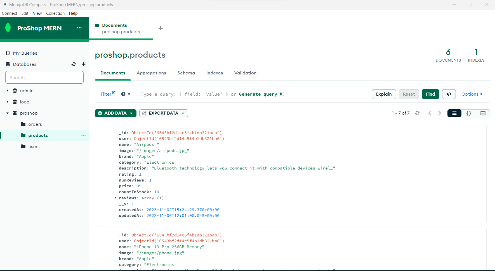
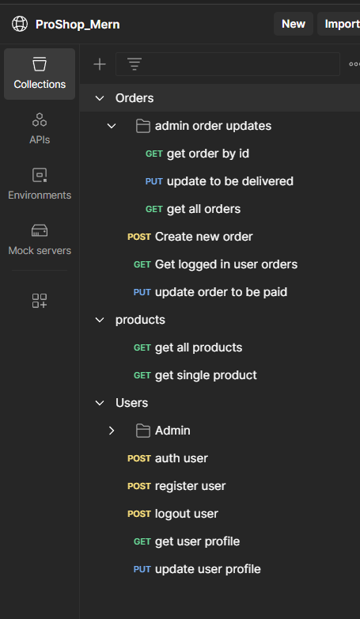

# ProShop eCommerce Platform 




## eCommerce platform built with the MERN stack & Redux.

- Full featured shopping cart
- Product reviews and ratings
- Top products carousel
- Product pagination
- Product search feature
- User profile with orders
- Admin product management
- Admin user management
- Admin Order details page
- Mark orders as delivered option
- Checkout process (shipping, payment method, etc)
- PayPal / credit card integration
- Database seeder (products & users)

## Usage

- Create a MongoDB database and obtain your `MongoDB URI` - [MongoDB Atlas](https://www.mongodb.com/cloud/atlas/register)
- Create a PayPal account and obtain your `Client ID` - [PayPal Developer](https://developer.paypal.com/)

### Env Variables

Rename the `.env.example` file to `.env` and add the following

```
NODE_ENV = development
PORT = 5000
MONGO_URI = your mongodb uri
JWT_SECRET = 'abc123'
PAYPAL_CLIENT_ID = your paypal client id
PAGINATION_LIMIT = 8
```

Change the JWT_SECRET and PAGINATION_LIMIT to what you want

### Install Dependencies (frontend & backend)

```
npm install
cd frontend
npm install
```

### Run

```

# Run frontend (:3000) & backend (:5000)
npm run dev

# Run backend only
npm run server
```

## Build & Deploy

```
# Create frontend prod build
cd frontend
npm run build
```

### Seed Database

You can use the following commands to seed the database with some sample users and products as well as destroy all data

```
# Import data
npm run data:import

# Destroy data
npm run data:destroy
```

```
Sample User Logins

admin@email.com (Admin)
123456

Aishu@email.com (Customer)
123456

Harry@email.com (Customer)
123456
```

---


### FAQ: How do I use Vite instead of CRA?

Ok so you're at **Section 1 - Starting The Frontend** in the course and you've
heard cool things about [Vite](https://vitejs.dev/) and why you should use that
instead of [Create React App](https://create-react-app.dev/) in 2023.

There are a few differences you need to be aware of using Vite in place of CRA
here in the course after [scaffolding out your Vite React app](https://github.com/vitejs/vite/tree/main/packages/create-vite#create-vite)

#### Setting up the proxy

Using CRA we have a `"proxy"` setting in our frontend/package.json to avoid
breaking the browser [Same Origin Policy](https://developer.mozilla.org/en-US/docs/Web/Security/Same-origin_policy) in development.
In Vite we have to set up our proxy in our
[vite.config.js](https://vitejs.dev/config/server-options.html#server-proxy).

```js
import { defineConfig } from 'vite';
import react from '@vitejs/plugin-react';

export default defineConfig({
  plugins: [react()],
  server: {
    // proxy requests prefixed '/api' and '/uploads'
    proxy: {
      '/api': 'http://localhost:5000',
      '/uploads': 'http://localhost:5000',
    },
  },
});
```

#### Setting up linting

By default CRA outputs linting from eslint to your terminal and browser console.
To get Vite to ouput linting to the terminal you need to add a [plugin](https://www.npmjs.com/package/vite-plugin-eslint) as a
development dependency...

```bash
npm i -D vite-plugin-eslint

```

Then add the plugin to your **vite.config.js**

```js
import { defineConfig } from 'vite';
import react from '@vitejs/plugin-react';
// import the plugin
import eslintPlugin from 'vite-plugin-eslint';

export default defineConfig({
  plugins: [
    react(),
    eslintPlugin({
      // setup the plugin
      cache: false,
      include: ['./src/**/*.js', './src/**/*.jsx'],
      exclude: [],
    }),
  ],
  server: {
    proxy: {
      '/api': 'http://localhost:5000',
      '/uploads': 'http://localhost:5000',
    },
  },
});
```

By default the eslint config that comes with a Vite React project treats some
rules from React as errors which will break your app if you are following Brad exactly.
You can change those rules to give a warning instead of an error by modifying
the **eslintrc.cjs** that came with your Vite project.

```js
module.exports = {
  env: { browser: true, es2020: true },
  extends: [
    'eslint:recommended',
    'plugin:react/recommended',
    'plugin:react/jsx-runtime',
    'plugin:react-hooks/recommended',
  ],
  parserOptions: { ecmaVersion: 'latest', sourceType: 'module' },
  settings: { react: { version: '18.2' } },
  plugins: ['react-refresh'],
  rules: {
    // turn this one off
    'react/prop-types': 'off',
    // change these errors to warnings
    'react-refresh/only-export-components': 'warn',
    'no-unused-vars': 'warn',
  },
};
```

#### Vite outputs the build to /dist

Create React App by default outputs the build to a **/build** directory and this is
what we serve from our backend in production.  
Vite by default outputs the build to a **/dist** directory so we need to make
some adjustments to our [backend/server.js](https://github.com/bradtraversy/proshop-v2/tree/main/backend/server.js)
Change...

```js
app.use(express.static(path.join(__dirname, '/frontend/build')));
```

to...

```js
app.use(express.static(path.join(__dirname, '/frontend/dist')));
```

and...

```js
app.get('*', (req, res) =>
  res.sendFile(path.resolve(__dirname, 'frontend', 'build', 'index.html'))
);
```

to...

```js
app.get('*', (req, res) =>
  res.sendFile(path.resolve(__dirname, 'frontend', 'dist', 'index.html'))
);
```

#### Vite has a different script to run the dev server

In a CRA project you run `npm start` to run the development server, in Vite you
start the development server with `npm run dev`  
If you are using the **dev** script in your root pacakge.json to run the project
using concurrently, then you will also need to change your root package.json
scripts from...

```json
    "client": "npm start --prefix frontend",
```

to...

```json
    "client": "npm run dev --prefix frontend",
```

Or you can if you wish change the frontend/package.json scripts to use `npm
start`...

```json
    "start": "vite",
```

#### A final note:

Vite requires you to name React component files using the `.jsx` file
type, so you won't be able to use `.js` for your components. The entry point to
your app will be in `main.jsx` instead of `index.js`

And that's it! You should be good to go with the course using Vite.

---
